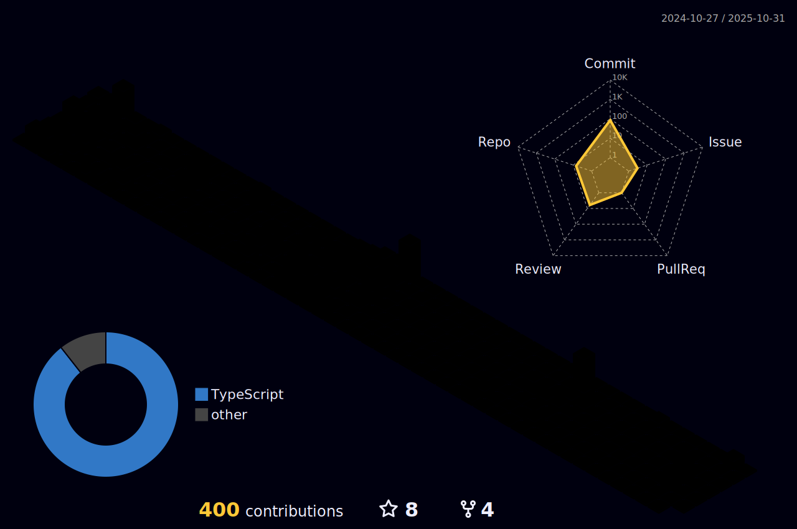

<!-- 
Hey what are you doing here? 
I admire your curiosity tho
Shoot me an email (zinean00 at gmail dot com)
Let's connect! 
-->

  
  

    
  <h3>About Me</h3>
  🫠cs + maths '25 @ vanderbilt university  
  🌊 2x dev director @ <a href="https://github.com/vandyhacks">VandyHacks</a>  
  📚 ex-engineering manager (team bookem) @ <a href="https://github.com/changeplusplusvandy">ChangePlusPlus<a>  
  🿠pulling weekend all nighters @ <a href="https://github.com/squ1rrel-ctf">squ1rrel-ctf</a>  
  
  <h3>Random</h3>
  ✍️ i occasionally do some ctf <a href="https://squ1rrel.dev/author/zineanteoh">writeups</a>  
  📱 one of my <a href="https://github.com/zineanteoh/vinkybox-app">favorite</a> personal project 
  📖 i dont remember all the books i read so i keep them at a <a href="https://www.goodreads.com/user/show/80901669-zi">safe place</a>
  

  

 
<!-- <i>generated by <a href="https://labs.openai.com/s/0hW1r6PFYo3Zh0a7UoxK2AMp" target="_blank">dall-e 2</a></i> -->

<h3>My recent activity</h3>

<!--START_SECTION:activity-->
1. 🔒 Closed issue [#408](https://github.com/VandyHacks/witness/issues/408) in [VandyHacks/witness](https://github.com/VandyHacks/witness)
2. 💪 Opened PR [#409](https://github.com/VandyHacks/witness/pull/409) in [VandyHacks/witness](https://github.com/VandyHacks/witness)
3. 🎉 Merged PR [#399](https://github.com/VandyHacks/witness/pull/399) in [VandyHacks/witness](https://github.com/VandyHacks/witness)
4. 🗣 Commented on [#399](https://github.com/VandyHacks/witness/pull/399#issuecomment-1760674063) in [VandyHacks/witness](https://github.com/VandyHacks/witness)
5. 💪 Opened PR [#406](https://github.com/VandyHacks/witness/pull/406) in [VandyHacks/witness](https://github.com/VandyHacks/witness)
<!--END_SECTION:activity-->

